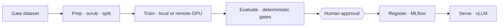

<p align="center">
  
</p>

<h1 align="center">cairn</h1>

<p align="center">
  <b>A self-hosted control plane for governed ModelOps.</b><br>
  Fine-tune, evaluate, promote, and serve models as single governed commands —
  cost-capped before the GPU spins up, policy-gated, and audited end to end.
</p>

<p align="center">
  <a href="https://docs.cairndev.sh"></a>
  <a href="https://cairndev.sh"></a>
  
  
</p>

<p align="center">
  <a href="https://docs.cairndev.sh">Docs</a> ·
  <a href="https://docs.cairndev.sh/installation/">Install</a> ·
  <a href="https://docs.cairndev.sh/modelops/">ModelOps lifecycle</a> ·
  <a href="https://docs.cairndev.sh/governance/">Governance</a> ·
  <a href="https://cairndev.sh">Waitlist</a>
</p>

---

## What is cairn?

cairn runs the work behind AI as **governed commands**. You declare an
outcome — gate a dataset, fine-tune a model, evaluate it against a baseline,
promote it, serve it — and cairn drives the tools underneath, enforces the
guardrails, and records exactly what ran.

The engine is **domain-neutral**. Everything that knows about a *domain* lives
in a **pack**; everything that touches a *tool* is an **operator**. The engine
never imports a pack — that one-way dependency is what lets the same machinery
run fine-tuning, dataset checks, model evaluation, or incident response, and
lets any operator inherit the budget, policy gate, and audit for free.

Everything is **self-hosted**: your keys, your GPUs, your logs. Nothing leaves
your perimeter.

## Why governed?

This is what separates cairn from a bare agent loop or a black-box tool — the
work runs behind deterministic guardrails you can inspect afterward:

- **Hard budget** — every run accrues cost in a scope; over the cap it raises
  `BudgetExceeded`, so a fine-tune can't quietly overspend.
- **Policy + human approval** — proposed actions pass declarative policy rules
  before any executor runs; high-risk ones (promote a model, destroy a
  resource) pause for a human and resume durably from a checkpoint.
- **Reproducible runs** — every run stores its validated inputs, a content-
  addressed schema hash, and the exact operators it resolved to. Replay any run;
  explain any result.
- **Tamper-evident audit** — every model call, tool call, and approval lands in
  a hash-chained, append-only log: what ran, what it cost, who approved it.
- **Citation validation** — for synthesized answers, every identifier the model
  cites is exact-string-matched against its context; unmatched citations are
  stripped.

## Quickstart

cairn is in **early access** — the source opens here shortly. Until then, the
docs cover the full CLI, architecture, and governance model:

- [Installation](https://docs.cairndev.sh/installation/) — extras (RAG, Temporal, Postgres, PII, telemetry) and the container image
- [CLI reference](https://docs.cairndev.sh/reference/cli/) — every command
- **[Join the waitlist](https://cairndev.sh)** for access

Once released, a governed run looks like this:

```bash
uv run cairn preflight training/finetune -i job.json   # cost, gates, blockers — no spend
uv run cairn run training/finetune --input job.json    # the governed run
```

## The ModelOps lifecycle

Each stage is a normal governed run; chained together they form one auditable
spine — as a template's subgraphs, or as an explicit
[pipeline](https://docs.cairndev.sh/pipelines/).



Deterministic gates decide pass/fail; LLM judges are advisory and off by
default. Promotion pauses for a human. Read the walkthrough in the
[ModelOps docs](https://docs.cairndev.sh/modelops/).

## One engine, many surfaces

The same governed core is driven from four places:

- **CLI** — the full control surface: run, preflight, replay, approve, deploy.
  → [CLI reference](https://docs.cairndev.sh/reference/cli/)
- **Web console** — a React app served at `/console`: runs, approval gates,
  pipelines, configuration, policies, connections, and a sandboxed Playground.
- **HTTP + SSE API** — everything the console does is a documented endpoint,
  including live run streaming. → [HTTP API](https://docs.cairndev.sh/reference/http-api/)
- **`cairn ask`** — natural-language intent resolved into governed plans; a
  read-only agent that never bypasses policy.

## Documentation

| | |
|---|---|
| [Overview](https://docs.cairndev.sh/) | What cairn is and the governance thesis |
| [Architecture](https://docs.cairndev.sh/architecture/) | Engine, packs, profiles, request lifecycle |
| [Packs](https://docs.cairndev.sh/concepts/packs/) · [Operators](https://docs.cairndev.sh/concepts/operators/) | The pack contract and the operator contract |
| [Governance](https://docs.cairndev.sh/governance/) | Policies, HITL gates, budget, audit |
| [Pipelines](https://docs.cairndev.sh/pipelines/) | Chain governed workflows with gates and events |
| [Deployment](https://docs.cairndev.sh/deployment/) | The compose stack: one `.env`, profile toggles |
| [Operators catalog](https://docs.cairndev.sh/reference/operators/) | Every shipped operator, by domain |

## Status & license

cairn is in **early access** and under active development. The API and command
surface may still change between releases.

The source opens here at release; a license is being finalized before a
formal open-source release — until a `LICENSE` file lands, all rights are
reserved. Interested in early access or a say in what ships next?
**[Join the waitlist](https://cairndev.sh).**
