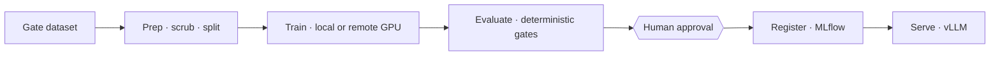

<p align="center">
  
</p>

<h1 align="center">cairn</h1>

<p align="center">
  <b>An open-source control plane for governed ModelOps.</b><br>
  Fine-tune, evaluate, promote, and serve models as single governed commands —
  cost-capped before the GPU spins up, policy-gated, and audited end to end.
</p>

<p align="center">
  <a href="https://docs.cairndev.sh"></a>
  <a href="https://cairndev.sh"></a>
  
  
</p>

<p align="center">
  <a href="https://docs.cairndev.sh">Docs</a> ·
  <a href="https://docs.cairndev.sh/installation/">Install</a> ·
  <a href="https://docs.cairndev.sh/modelops/">ModelOps lifecycle</a> ·
  <a href="https://docs.cairndev.sh/governance/">Governance</a> ·
  <a href="https://cairndev.sh">Waitlist</a>
</p>

---

## What is cairn?

cairn runs the work behind AI as **governed commands**. You declare an
outcome — gate a dataset, fine-tune a model, evaluate it against a baseline,
promote it, serve it — and cairn drives the tools underneath, enforces the
guardrails, and records exactly what ran.

The engine is **domain-neutral**. Everything that knows about a *domain* lives
in a **pack**; everything that touches a *tool* is an **operator**. The engine
never imports a pack — that one-way dependency is what lets the same machinery
run fine-tuning, dataset checks, model evaluation, or incident response, and
lets any operator inherit the budget, policy gate, and audit for free.

cairn is **open source** (Apache 2.0) and **self-hosted by default**: your
keys, your GPUs, your logs — nothing leaves your perimeter. A **managed
cloud** is in private beta for teams who would rather not run it themselves;
the engine is the same either way.

## Why governed?

This is what separates cairn from a bare agent loop or a black-box tool — the
work runs behind deterministic guardrails you can inspect afterward:

- **Hard budget** — every run accrues cost in a scope; over the cap it raises
  `BudgetExceeded`, so a fine-tune can't quietly overspend.
- **Policy + human approval** — proposed actions pass declarative policy rules
  before any executor runs; high-risk ones (promote a model, destroy a
  resource) pause for a human and resume durably from a checkpoint.
- **Reproducible runs** — every run stores its validated inputs, a content-
  addressed schema hash, and the exact operators it resolved to. Replay any run;
  explain any result.
- **Tamper-evident audit** — every model call, tool call, and approval lands in
  a hash-chained, append-only log: what ran, what it cost, who approved it.
- **Citation validation** — for synthesized answers, every identifier the model
  cites is exact-string-matched against its context; unmatched citations are
  stripped.

## Quickstart

The engine ships as the `cairndev` distribution (import name `cairn`). The `cairndev` wheel
carries the builtin operator packs (14) and the core contracts (13); their sources live under
`packages/` in this repository. The public release is five wheels: `cairndev`, `cairn-client`,
the optional Metaflow and SkyPilot engines, and the example pack `cairn-pack-hello`.

```bash
git clone https://github.com/cairndev-sh/cairn && cd cairn
uv sync --extra dev
uv run cairn --help
```

A domain pack is a data wheel the engine discovers through an entry point; the example
pack shows the shape, and a governed run is a declared pipeline:

```bash
CAIRN_PACK_PATH=examples/hello-cairn uv run cairn pipeline ls
CAIRN_PACK_PATH=examples/hello-cairn uv run cairn pipeline explain hello-cairn/profile-and-publish
```

Those are the commands the public CI job runs on every change. The container image is
built from `Dockerfile.engine`, the Helm chart lives under `deploy/helm/cairn`, and the
optional extras are `auth`, `dataflow-engine`, `dev`, `hello`, `infisical`, `kernel`, `metaflow`, `nats`, `oauth`, `optuna`, `pii`, `rag`, `rag-pgvector`, `rag-pinecone`, `rag-qdrant`, `rag-sqlite-vec`, `rerank-cohere`, `rerank-cross-encoder`, `runtime-dbos`, `runtime-postgres`, `runtime-sqlite`, `runtime-temporal`, `skypilot`, `ssh`, `storage-postgres`, `telemetry`, `train`.
Full setup: [Installation](https://docs.cairndev.sh/installation/) ·
[CLI reference](https://docs.cairndev.sh/reference/cli/).

## The ModelOps lifecycle

Each stage is a normal governed run; chained together they form one auditable
spine — as a template's subgraphs, or as an explicit
[pipeline](https://docs.cairndev.sh/pipelines/).


```mermaid
flowchart LR
  D[Gate dataset] --> P[Prep · scrub · split]
  P --> T[Train · local or remote GPU]
  T --> E[Evaluate · deterministic gates]
  E --> H{{Human approval}}
  H --> R[Register · MLflow]
  R --> S[Serve · vLLM]
```

Deterministic gates decide pass/fail; LLM judges are advisory and off by
default. Promotion pauses for a human. Read the walkthrough in the
[ModelOps docs](https://docs.cairndev.sh/modelops/).

## One engine, many surfaces

The same governed core is driven from three places:

- **CLI** — the full control surface: run, preflight, replay, approve, deploy.
  → [CLI reference](https://docs.cairndev.sh/reference/cli/)
- **Web console** — a React app served at `/console`: runs, approval gates,
  pipelines, configuration, policies, connections, and a sandboxed Playground.
- **HTTP + SSE API** — everything the console does is a documented endpoint,
  including live run streaming. → [HTTP API](https://docs.cairndev.sh/reference/http-api/)

## Documentation

| | |
|---|---|
| [Overview](https://docs.cairndev.sh/) | What cairn is and the governance thesis |
| [Architecture](https://docs.cairndev.sh/architecture/) | Engine, packs, profiles, request lifecycle |
| [Packs](https://docs.cairndev.sh/concepts/packs/) · [Operators](https://docs.cairndev.sh/concepts/operators/) | The pack contract and the operator contract |
| [Governance](https://docs.cairndev.sh/governance/) | Policies, HITL gates, budget, audit |
| [Pipelines](https://docs.cairndev.sh/pipelines/) | Chain governed workflows with gates and events |
| [Deployment](https://docs.cairndev.sh/deployment/) | The compose stack: one `.env`, profile toggles |
| [Operators catalog](https://docs.cairndev.sh/reference/operators/) | Every shipped operator, by domain |

## Status & license

cairn is in **early access** and under active development. The API and command
surface may still change between releases; see [`CHANGELOG.md`](./CHANGELOG.md).

Licensed under the **Apache License 2.0** — see [`LICENSE`](./LICENSE).
Contributions are welcome: read [`CONTRIBUTING.md`](./CONTRIBUTING.md) first.
Interested in the managed cloud or a say in what ships next?
**[Join the waitlist](https://cairndev.sh).**
